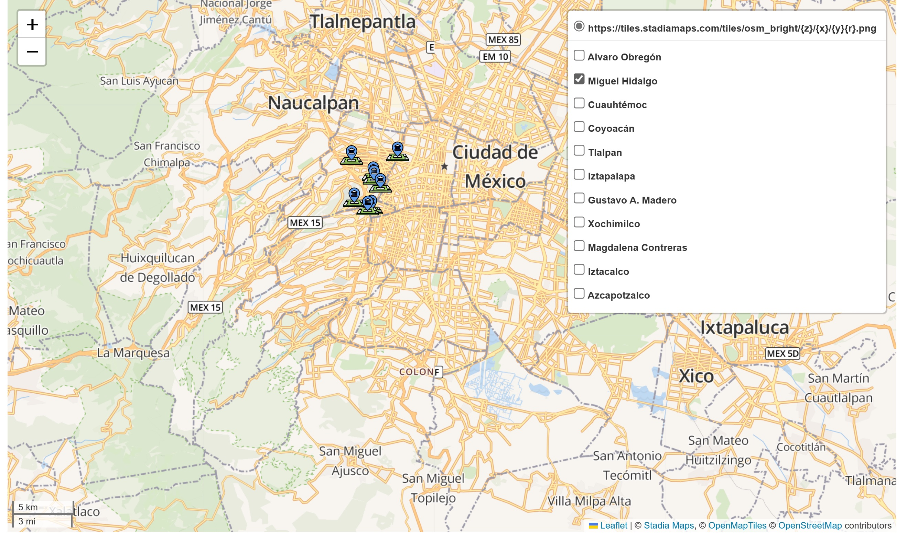
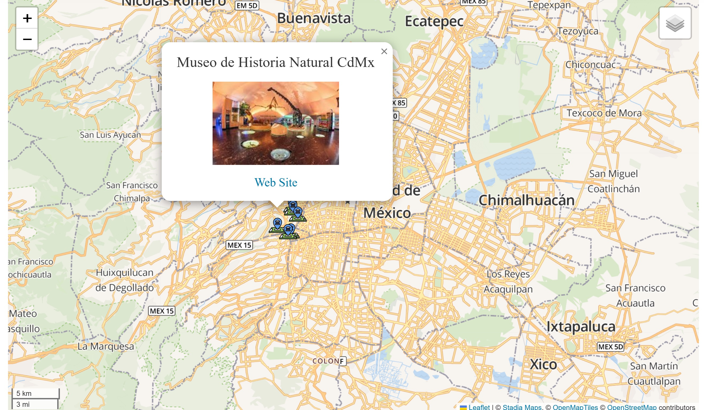

## 🤖 Hi!, I'm Araceli Carreño Ibáñez
I'm Consultant in Data Analytics and Artificial Intelligence. I have a keen interest in designing, building, and deploying machine learning and deep learning applications, as well as writing about Data Science, Artificial Intelligence and Project Management topics. Outside of work, I enjoy...

- 🎹 Playing Piano
- 📚 Reading.
- 🛩️Traveling.

## Project Portfolio

### Interactive Map of Museums in Mexico City
This project uses Geopandas and Folium to generate an interactive map with markers of the main museums in Mexico City, which you can consult by town hall. In addition, through pop-up windows the names, images and websites of the museums are displayed.

- I used Geocoding to converting museums' name into geographic coordinates (latitude and longitude).
- I used a GeoDataFrame to store the museums information.
- I create a map centered on Mexico City, adds markers for the principal museums of Mexico City and pop-up displaying the museum names, images, and websites.To improve the readability and usability of the map, I add a menu bar to display museums by town hall. 

You can select Town Hall:

Pop-up windows show the name, image and website of the selected museum:

## Writing
